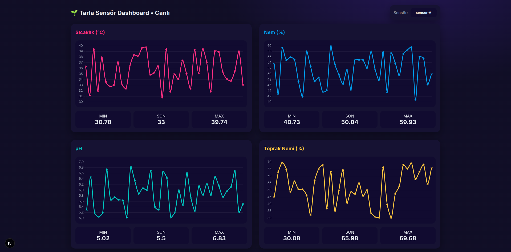

# 🌱 Tarla Sensör Dashboard (Farm Sensor Dashboard)

## 📌 Proje Özeti (Türkçe Açıklama)

Bu proje, bir tarla içerisindeki sensörlerden sıcaklık, nem, pH ve toprak nemi gibi verileri gerçek zamanlı olarak takip etmeyi sağlar. Amaç çiftçilerin tarladaki verileri uzaktan izleyebilmesidir.

- Gerçek zamanlı grafiklerle canlı veri takibi
- Simülatör ile MQTT üzerinden veri üretimi
- PostgreSQL veri tabanı ile kayıt
- Next.js arayüzü ile modern frontend
- Docker Compose ile tüm servisleri tek komutla ayağa kaldırma

---

## 💼 Project Summary (English Overview)

A real-time monitoring dashboard for agricultural sensors (temperature, humidity, pH, soil moisture) designed for farmers to view live data from the field.

**Tech Stack:**
- 🧠 Backend: Node.js + Express + MQTT
- 📊 Frontend: Next.js + Chart.js
- 🐘 Database: PostgreSQL
- 📦 DevOps: Docker Compose

---

# 📂 Project Structure

- /backend       -> Express.js API & MQTT listener
- /frontend      -> Next.js dashboard with sensor charts
- /simulator     -> Sensor data simulator (publishes to MQTT)
- /docker        -> Full stack orchestration

---


## 🚀 Getting Started

```bash
# 1. Clone the repository
git clone https://github.com/fatihkartl/iot-farm-dashboard.git
cd tarla-dashboard

# 2. Start all services
docker compose up --build or docker compose up --build -d

After running, access:

Frontend: http://localhost:3000

API: http://localhost:8080/health
```
---
## 📸 Screenshots

| Dashboard                         | Live Charts                   |
| --------------------------------- | ----------------------------- |
|  |  |

